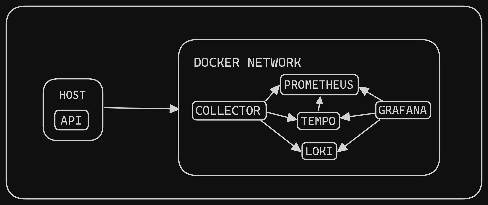

# Instrumented Python API
Configuração base para instrumentação de uma API Python com o Opentelemetry Collector e a stack do Grafana.

### Stack
- Opentelemetry Collector
- Prometheus
- Loki
- Tempo
- Grafana

### Arquitetura

O armazenamento de logs, traces e metrics é feito localmente e algumas escolhas de arquitetura foram feitas pensando na preservação de configurações padrão buscando simplificar o processo de aprendizagem.

Por exemplo, a aplicação está com `network_mode: host` pois o opentelemetry collector exporta os dados de observabilidade por padrão para o localhost:4317/4318.

### Setup
Toda a instrumentação foi feita usando o Docker Compose, logo pode-se rodar a aplicação chamando o seguinte comando:
```
docker compose up --build
```

### Ports
As portas padrões que os services estão rodando são as seguintes:
- API - 8000
- Grafana Dashboard - 3000
- Prometheus - 9090
- Tempo - 3200
- Loki - 3100
